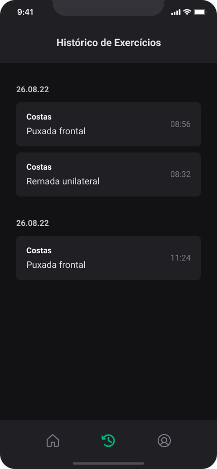

## 💻 Ignite Gym

### Objective:
- App developed to assist with exercise routines at the gym. It provides information on exercises, sets and repetitions, along with a GIF demonstrating how to perform each exercise.
- The app features a user login and management system to save your history of completed exercises.
- Additionally, the app features a SQLITE database for user data persistence, as well as a refresh token system.

### See the project...

  
  
  
 
  
  
  

### Techs
- React Native
- Typescript
- Styled Components
- Native Base
- Async Storage
- SQLITE
- React Hook Form
- yup
- axios
- Babel-plugin-module-resolver
